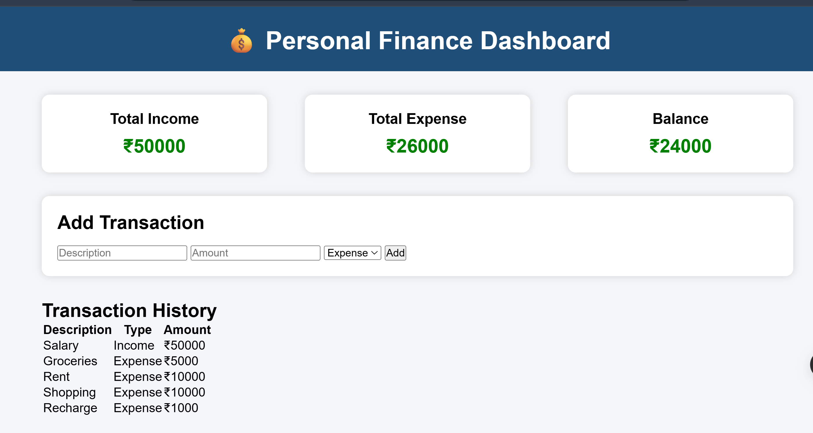

# 💰 Personal Finance Dashboard

A simple and interactive **Personal Finance Dashboard** built using **HTML, CSS, and JavaScript**. This project allows users to track their income and expenses, view their current balance, and maintain a transaction history in a clean and user-friendly interface.

---

## 📌 Features

- ➕ Add Income and Expense transactions
- 💵 Automatically calculates Total Income
- 💸 Automatically calculates Total Expenses
- 📊 Displays Current Balance
- 📜 Maintains Transaction History
- ✅ Input validation for empty or invalid entries
- 🎨 Clean and responsive user interface

---

## 🛠️ Technologies Used

- HTML5
- CSS3
- JavaScript (Vanilla JS)

---
## 🚀 Live Demo

🔗 **Live Website:** https://sanjanasripada12.github.io/Finance_Tracker/

## 📷 Project Preview

[Watch the Demo](Finance_Tracker.mp4)
---

## 📂 Project Structure

```
Personal-Finance-Dashboard/
│
├── index.html
├── style.css
├── script.js
├── Finance_Tracker.png
└── README.md
```

---

## 🚀 How to Run

1. Clone the repository

```bash
git clone https://github.com/your-username/Personal-Finance-Dashboard.git
```

2. Open the project folder

```bash
cd Personal-Finance-Dashboard
```

3. Open `index.html` in your browser.

No installation or additional libraries are required.

---

## 📖 How It Works

1. Enter a transaction description.
2. Enter the amount.
3. Select **Income** or **Expense**.
4. Click **Add**.
5. The dashboard automatically:
   - Updates Total Income
   - Updates Total Expense
   - Calculates Balance
   - Adds the transaction to the history table

---

## 💡 Future Improvements

- 🗑️ Delete transactions
- ✏️ Edit existing transactions
- 💾 Store data using Local Storage
- 📅 Filter transactions by date
- 📈 Charts for income and expenses
- 🌙 Dark Mode
- 📱 Improved mobile responsiveness

---

## 📸 Screenshots

### Dashboard



---

## 👩‍💻 Author

**Sanjana Sripada**

GitHub: https://github.com/SanjanaSripada12

---

## ⭐ Show Your Support

If you like this project, please consider giving it a ⭐ on GitHub!
